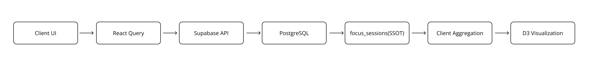

# 📝 Focusdo App — 집중 타이머 및 생산성 분석 앱

[English](./README.md) | [한국어] | [日本語](./README.ja.md)

---

FocusDo는 할 일 관리와 집중 세션 추적을 결합한 생산성 웹 애플리케이션입니다.
집중 세션은 `focus_sessions` 테이블에 가공되지 않은 이벤트 데이터(Raw data)로 저장됩니다. 집계된 지표를 별도로 저장하는 대신, 세션 기록으로부터 동적으로 분석 데이터를 도출합니다.
세션 데이터는 React Query를 사용하여 Supabase에서 가져오며, 일일 통계 및 생산성 인사이트를 생성하기 위해 클라이언트 측에서 집계됩니다.
할 일(Todo) 통계와 집중 세션 데이터는 대시보드와 히스토리 시각화의 기반이 됩니다.
시스템은 페이지(Page)가 UI 구성을 조정하고, 훅(Hooks)이 도메인 로직을 캡슐화하며, 기능(Feature) 모듈이 인터랙티브 UI 컴포넌트를 구현하는 계층형 클라이언트 아키텍처를 따릅니다.
이러한 아키텍처는 데이터 저장, 분석 계산, 시각화를 분리함으로써 집중 추적 도메인을 단순하게 유지합니다.

---

## 🔗 라이브 데모

focus-based-todo.vercel.app

---

## ✨ 주요 기능

- ⏱️ Focus Timer
- 📝 Todo 관리
- 📊 일일 생산성 대시보드
- 📈 주간 집중 시간 분석
- 🗂️ Focus Session 히스토리
- 📉 D3 기반 데이터 시각화
- ⚡ React Query 기반 데이터 캐싱

---

## 🗂️ 페이지 구성

### Today Page

메인 생산성 페이지입니다.

사용자는 다음 작업을 수행할 수 있습니다.

- 주간 캘린더 확인
- 오늘의 Todo 관리
- 집중 세션 시작
- 오늘의 생산성 통계 확인

대시보드는 다음 정보를 요약합니다.

- 총 집중 시간
- Todo 완료율
- 완료된 작업 수

---

### Focus Page

선택한 Todo에 대해 집중 타이머를 실행하는 페이지입니다.
타이머가 종료되면 다음 정보가 데이터베이스에 저장됩니다.

- user_id
- todo_id
- duration
- start_time

---

### Focus History Page

집중 기록을 확인하는 페이지입니다.

- 주간 집중 트렌드는 차트로 시각화됩니다.
- 일별 기록은 카드 형태로 표시됩니다.
- 상세 기록은 모달에서 확인할 수 있습니다.

## 🛠️ 기술 스택

### Frontend

- React
- TypeScript

### Routing

- React Router

### State Management

- Zustand (UI state)

### Server State

- TanStack Query

### Backend / Database

- Supabase (PostgreSQL)

### Visualization

- D3.js

### Styling

- Tailwind CSS
- shadcn/ui

### Date Handling

- Day.js

---

## 📊 아키텍처 개요

애플리케이션은 UI 렌더링, 도메인 로직, 그리고 서버 상태(Server State)를 분리합니다.
다음 다이어그램은 애플리케이션에서 사용되는 단방향 데이터 흐름과 클라이언트 측 집계 파이프라인(Aggregation Pipeline)을 보여줍니다.



Page는 애플리케이션 흐름과 UI 구성을 조정하는 역할을 하며,
도메인 로직은 재사용 가능한 hooks에 캡슐화했습니다.

Feature 모듈은 이러한 hooks를 조합하여
사용자 인터랙션을 구현하는 UI 컴포넌트를 담당합니다.

---

## 🏗 설계 원칙

### 페이지 단위 오케스트레이션

페이지 컴포넌트는 UI 구성을 조정하지만, 도메인 로직을 직접 구현하는 것은 지양합니다.
대신, 행위를 캡슐화하는 훅(Hooks)과 스토어(Stores)를 조합하여 사용합니다.

---

### 도메인 로직 분리

할 일(Todo) 조작, 집중 추적, 분석 로직은 페이지 컴포넌트가 아닌 훅과 기능(Feature) 모듈에 구현됩니다.
이는 유지보수성과 테스트 가능성을 향상시킵니다.

---

### 명시적인 UI 상태 모델링

UI는 다음과 같은 주요 상태를 명시적으로 모델링합니다:

- loading
- empty
- read-only
- error

이러한 상태들은 전용 UI 컴포넌트를 통해 표현됩니다.

---

### 과도한 최적화 지양

가상화(Virtualization)나 페이지네이션(Pagination)과 같은 복잡한 최적화는 실제 사용 패턴에서 요구될 때까지 의도적으로 보류합니다.

---

## 🔄 데이터 흐름

```
Today 페이지에서 Todo 생성
        ↓
Focus Timer (Focus Page)
        ↓
Focus Session 완료
        ↓
Focus Session 저장
        ↓
Supabase Database (focus_sessions)
        ↓
React Query 훅
        ↓
클라이언트 사이드 aggregation
        ↓
Dashboard / Analytics Hooks
        ↓
Visualization Components
```

---

## 🧩 Analytics 구조

분석 데이터는 원본 세션 기록으로부터 클라이언트 측에서 계산됩니다.

### Data Fetch Layer

- `useTodayFocusTime`
- `useTodoFocusTime`

집중 세션 기록을 가져오고 전체 지속 시간을 계산합니다.

---

### Analytics Layer

- `useDayDashboard`

집중 통계와 할 일 완료 지표를 결합하여 대시보드 데이터를 생성합니다.

---

### Visualization Layer

- Dashboard components
- History charts (D3)

이 컴포넌트들은 집계된 데이터를 차트와 요약 카드로 표시합니다.

---

## 📂 프로젝트 구조

```
src
 ├ api
 ├ components
 ├ constants
 ├ features
 │   ├ dashboard
 │   ├ date
 │   ├ history
 │   └ todo
 ├ hooks
 ├ lib
 ├ pages
 └ provider
 └ store
 └ types
```

이 구조는 UI, 도메인 로직, 그리고 데이터 액세스 계층을 분리합니다.
시스템의 모듈화와 확장성을 유지하기 위해 도메인 로직은 UI 컴포넌트와 분리되어 있습니다.

---

## 🧠 설계 결정

### 읽기 전용 날짜 모델

오해를 불러일으킬 수 있는 상호작용을 방지하기 위해 과거와 미래의 날짜는 읽기 전용으로 처리됩니다.
사용자는 현재 날짜의 할 일만 수정할 수 있습니다.

---

### 명시적인 빈 상태(Empty States)

사용자가 현재 컨텍스트와 상호작용할 수 있는지 전달하기 위해 빈 상태를 의도적으로 모델링했습니다.

---

### 상태가 없는(Stateless) 날짜 탐색

페이지 간의 숨겨진 결합을 피하기 위해 캘린더 탐색 로직은 상태가 없는 유틸리티로 구현되었습니다.

---

## ⚖️ 절충 사항

- 데이터베이스 뷰(View)를 사용하는 대신 클라이언트 측에서 분석 데이터를 계산합니다.
- 집중 기록 시각화는 확장성보다 명확성을 우선시합니다.
- 모바일 UX는 기능적으로 작동하지만 작은 화면에 완전히 최적화되지는 않았습니다.

---

## 🚀 실행 방법

```bash
npm install
npm run dev
```

---

## 📈 향후 개선 사항

- 대규모 데이터셋을 위한 리스트 가상화(Virtualization)
- 확장된 생산성 분석 기능
- 모바일 경험 개선
- 다크 모드 지원
- 데이터베이스 뷰 기반의 집계 방식 도입
- 인덱스를 활용한 쿼리 성능 최적화
- 타이머 세션 복구 기능

---

## 📄 라이선스

MIT
